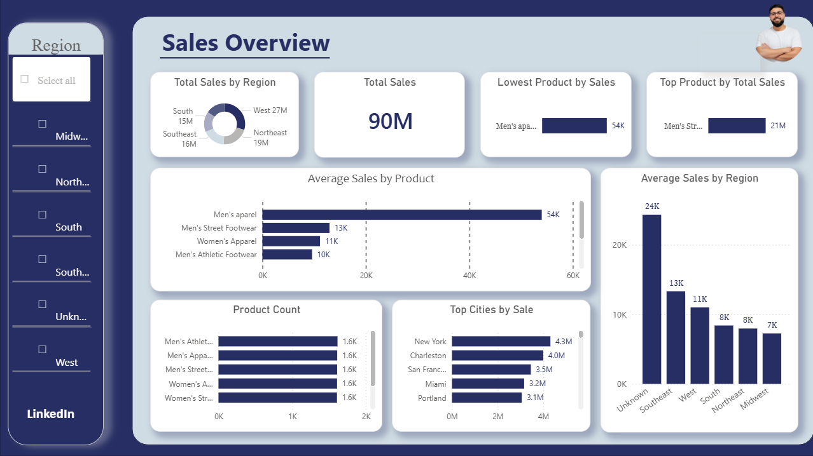
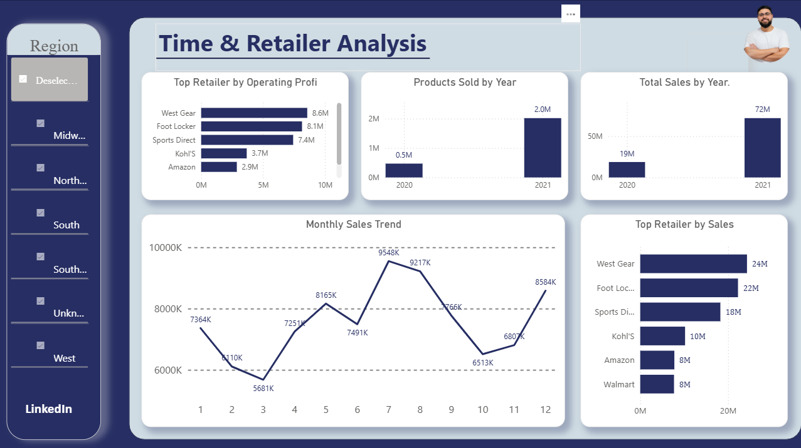
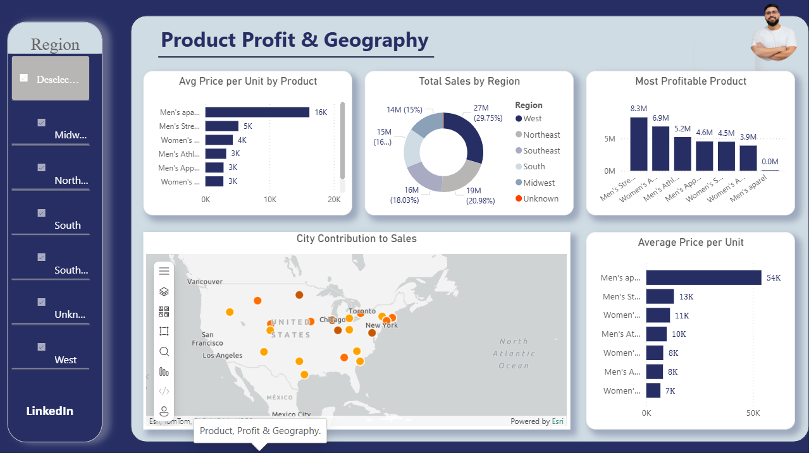

# 📊 Retail Sales Data Analysis — End-to-End Project

An end-to-end **Retail Sales Data Analysis** project that transforms raw retail data into meaningful business insights using **Python, Pandas, NumPy, and Power BI**.

The project covers the complete analytics workflow — from **data cleaning and preparation** to **exploratory data analysis, business insights, and interactive dashboard development**.

---

## 🚀 Project Overview

This project analyzes retail sales data to understand:

* 📈 Overall sales performance
* 🛍️ Product performance and profitability
* 🏪 Retailer performance
* 📅 Sales trends over time
* 🌍 Geographic sales distribution
* 💰 Profitability and pricing patterns

The analysis was performed using **Python & Pandas**, while the final insights were presented through an interactive **Power BI Dashboard**.

The project also includes data-cleaning operations to handle issues such as:

* Missing values
* Inconsistent text formatting
* Case-sensitivity problems
* Duplicate or inconsistent records
* Data type inconsistencies

---

## 🎯 Business Questions

The project answers the following key business questions:

### 📈 Sales Analysis

* What are the **Total Sales**?
* What is the **Average Sales by Region**?
* What is the **Average Sales by Product**?
* How many times was each product sold?
* Which product generated the **highest sales**?
* Which product generated the **lowest sales**?

### 📅 Time Analysis

* Which products were sold each year?
* How did sales change over the years?
* What are the **Month-over-Month (MoM)** sales trends?

### 🏪 Retailer Analysis

* Which retailer achieved the **highest total sales**?
* Which retailer generated the **highest operating profit**?

### 💰 Product & Profit Analysis

* Which product is the **most profitable**?
* What is the **average price per unit**?

### 🌍 Geographic Analysis

* Which region generated the **highest sales**?
* Which city contributed the most to total sales?

---

## 🛠️ Tech Stack

| Technology          | Purpose                      |
| ------------------- | ---------------------------- |
| 🐍 Python           | Data analysis & processing   |
| 🐼 Pandas           | Data cleaning & manipulation |
| 🔢 NumPy            | Numerical operations         |
| 📓 Jupyter Notebook | Interactive analysis         |
| 📊 Power BI         | Interactive dashboards       |
| 🗃️ CSV             | Data storage & exchange      |

---

## 🔄 Project Workflow

```text
Raw Data
   ↓
Data Loading
   ↓
Data Cleaning & Preparation
   ↓
Exploratory Data Analysis
   ↓
Business Questions
   ↓
Data Aggregation & Analysis
   ↓
Power BI Dashboard
   ↓
Business Insights
```

---

# 📊 Power BI Dashboard

The final Power BI dashboard is divided into **three analytical sections** to provide a clear view of sales, time trends, retailers, products, profitability, and geography.

---

## 1️⃣ Sales Overview

Provides a high-level overview of the company's sales performance, including overall sales KPIs and product/region performance.



---

## 2️⃣ Time & Retailer Analysis

Focuses on sales trends over time and compares retailer performance to identify the strongest-performing retailers.



---

## 3️⃣ Product Profit & Geography

Analyzes product profitability, pricing performance, regional sales, and geographic contribution.



---

# 📂 Project Structure

```text
Retail-Sales-Data-Analysis/
│
├── 📁 Pandas Project/
│   │
│   ├── 📄 data.csv
│   ├── 📄 products.csv
│   ├── 📄 cleaned_retail_sales.csv
│   │
│   ├── 📊 cleaned_retail_sales.pbix
│   │
│   ├── 📓 Retail Sales Data Analysis — Pandas Project.ipynb
│   │
│   └── 📖 README.md
│
└── 📄 README.md
```

---

# 🧹 Data Cleaning

Before performing the analysis, the raw dataset was processed and cleaned using **Pandas**.

Key preprocessing steps included:

* Handling missing values
* Standardizing text columns
* Resolving case-sensitivity issues
* Converting columns to appropriate data types
* Removing inconsistent records
* Preparing datasets for analysis and visualization

The cleaned dataset was exported as:

```text
cleaned_retail_sales.csv
```

---

# 📊 Data Analysis

The analysis was implemented using **Pandas and NumPy**.

Main techniques included:

* `groupby()`
* `agg()`
* `sum()`
* `mean()`
* `count()`
* `sort_values()`
* Time-based analysis
* Product-level analysis
* Retailer-level aggregation
* Regional and city-level analysis

The complete analysis can be found in:

```text
Retail Sales Data Analysis — Pandas Project.ipynb
```

---

# 💡 Key Insights

The project is designed to transform raw transactional data into actionable business insights by identifying:

* 🏆 Best-performing products
* 💰 Most profitable products
* 🏪 Top-performing retailers
* 📈 Sales growth and decline patterns
* 🌍 Highest-performing regions and cities
* 📅 Seasonal and monthly sales trends
* 💵 Average pricing patterns

---

# 📈 Dashboard Highlights

The Power BI dashboard provides an interactive way to explore:

**Sales Performance**

* Total Sales
* Average Sales
* Product Sales
* Regional Performance

**Time Trends**

* Yearly Sales
* Monthly Sales
* Sales Changes Over Time

**Retailer Performance**

* Total Sales by Retailer
* Operating Profit by Retailer

**Product & Profitability**

* Most Profitable Products
* Average Price per Unit

**Geographic Performance**

* Sales by Region
* Sales by City

---

# 🎓 Skills Demonstrated

This project demonstrates practical experience in:

* 🐍 Python for Data Analysis
* 🐼 Pandas Data Manipulation
* 🔢 NumPy
* 🧹 Data Cleaning & Preprocessing
* 📊 Exploratory Data Analysis (EDA)
* 📈 Business Analysis
* 🗃️ CSV Data Processing
* 📊 Power BI Dashboard Development
* 💡 Business Insight Generation
* 📅 Time-Series Analysis
* 🌍 Geographic Analysis

---

# 🚀 Project Goal

The main goal of this project is to demonstrate a complete **Data Analytics workflow**, starting from raw data and ending with an interactive business intelligence dashboard.

> **Raw Data → Clean Data → Analysis → Insights → Interactive Dashboard**

---

## 👨‍💻 Author

**Fares Ali**

Computer & Control Engineering Student
Aspiring **Data Engineer & Data Analyst**

### 🛠️ Areas of Interest

`Python` • `SQL` • `Pandas` • `Power BI` • `ETL` • `Data Engineering` • `Data Analytics`

---

⭐ If you find this project useful, feel free to explore the notebook and dashboard.
